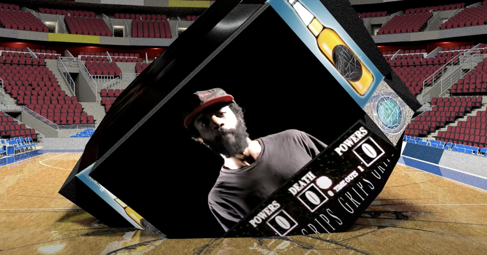
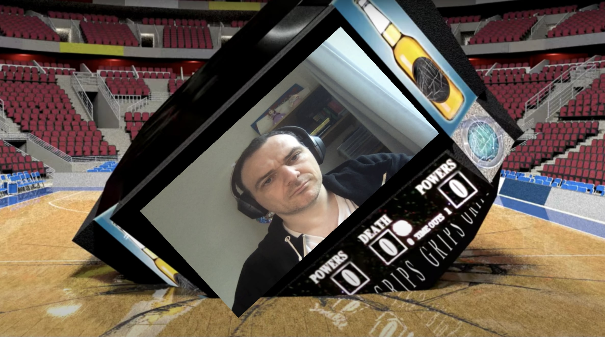
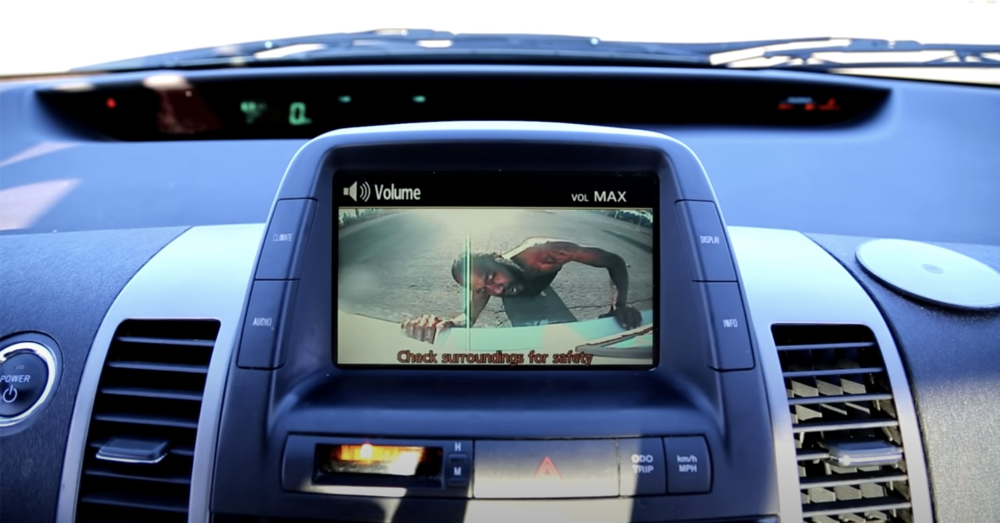
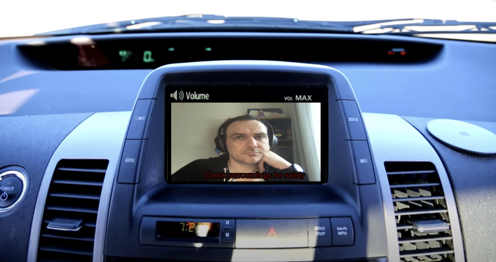
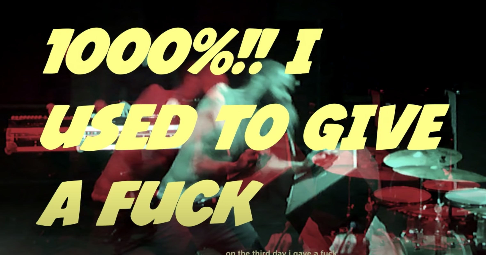

# Death Grips simulator

> As theorized by Vertov, film can overcome its indexical nature though montage, by presenting a viewer with objects that never existed in reality

<i>Lev Manovich, 2001</i>

The purpose of this simulator(s) is the demonstration of non-visual nature of the band's performance, which goes against the visual hegemony of popular music, and hip hop in particular. The band makes clear attempts to reject, or at least ironisize by exaggerating the presence of scopic regime as the necessary condition for music videos, thus exposing the break with the classic synechdochal relationship between artist’s performance and the music video as the concept.

This is the attempt to partially evaluate whether they have succeeded.

## Background and reasoning

>These simulations are essentially a completely isolated visual component of the respective music videos — removed are the music, the lyrics, the sound, the artists themselves, their performance, the timeline. What is left is the superficial visual frame, that represents the only relatively stable narrative element in their music videos. The purpose is to demonstrate tasks carried out by the band’s performance versus the tasks done by the visuals.
>
>The bands’ performance within the frame has been replaced with the direct webcam stream of the reader/viewer. The viewer then is invited to observe the personal reaction to the seen, altering own behaviours on the screen. The viewer is also encouraged to attempt to imitate the band members as well. This is a highly experiential experiment.

_Cool media as the way to reclaim music from audiovisual hegemony_, (2020)

## How to use

1. Click on the **original** first and watch the clip. Jumping around the timeline is ok, try to get the gist of the visual elements and how they work together with the delivery. Return by clicking **back** in your browser
2. Now click the **simulation** of the same clip. Be patient while it loads. Observe the same visuals _sans_ the band's input. Watch yourself replacing the band, try to immitate what you saw in the previous video. Cringe a bit. Go **back**
3. Repeat with all videos.
4. ???
5. PROFIT

**`Webcam necessary. Not compatible with mobile.`**

Currently, three videos are simulated:

## Simulators
### Inanimate Sensation

#### Original video: [link](https://www.youtube.com/watch?v=r5GCn1BKkxg)

#### Simulator: [link](https://www.openprocessing.org/sketch/910202/embed/?plusEmbedHash=ZDg3MTgyYzI5YzU0MDFjNTM4NTZlYTZmM2NjZTQ3NzY4NmZhOTNiODI2ZWI5MmY5ZWFiNGM1ZDhmMDlmNDlkZDAzOTdmMzE5NjI0ZjYwNTEwNjg5NjQ3ODY1YjJmMzE1ZjMyYmExN2RkM2U0YWQ2ZjI1MjVmYjk5YWY5OGNmZWJ2RG11QUR0S1hXZUlJN0JOUHg0L1NKK095MVB3NHVsdTFvV0hlK1AwTjVLWnUwNHJXaHdlU3VsVzBNYmVnMCs1ZzR4Z2pYN21UbHkzVHE5bndkb0duUT09&plusEmbedTitle=true&plusEmbedFullscreen=true)

### Double Helix

#### Original video: [link](https://www.youtube.com/watch?v=tWzJhkrZm5Y)

#### Simulator: [link](https://www.openprocessing.org/sketch/910456/embed/?plusEmbedHash=Y2EwZmE4ZjNmZTgwZTYzZTA4YTc1NmI1YmFhNmMyNjhiNjM0MWMwZGY0NjE2YzliOGZkMWVmYmViNGI4NTY4YjYwNjEzNjk2NGI1MTU1MDFhOTg2NTEyYzdjZTQwZDliYWRjZTE5ZDVmZTU5ZTRmMzg2ZDkwZjYzMDZlZTAxYTMrOWlQdTBNczBLeWlKV0R5SDhHeXB5aTJsd2tmZ3FFYlgyVVcxUjhYYVd3TWsvcVhRRkJRbmRBSWE4NUJKQmJCaVlXV0ZqbVBTd3ZkbGtBQzMzaHFmdz09&plusEmbedTitle=true&plusEmbedFullscreen=true)

### No Love (Original Video)

#### Original video: [link](https://www.youtube.com/watch?v=2MHhLDCJ57E)

#### Simulator: [link](https://www.openprocessing.org/sketch/911210/embed/?plusEmbedHash=MDQyN2IzMjNlNmI1MGYyODQ3MTI2YmJmMDk1N2U5MTc2OTkxMDEyY2I1Mzg3MzI0ODkzZDJjMjM3OWU0Mjc5ZGEzY2MxMzQ3NjdjODNhZGVhMzM1OGZiNGYzNDI4OWE4YjFiNzQ3MWYzNGFiZGIyOGVmYmEzYjA3N2Y0Yjk1ZmRPeCtXalp3eGpSUHM3ckRCYTBUZm53MHRYY0VGVXhyTmt1Y2QyYjB5NU56TnBCam0zOUJuNEhFSGJIa1E2Wm5NdXUxdURQRk8rRmIxUEIwS1hpL3JwUT09&plusEmbedTitle=true&plusEmbedFullscreen=true)

working js hosted on https://www.openprocessing.org/user/210599#sketches

## License
All work present on this site is licensed under [WTFPL — _Do What The Fuck You Want to Public License_](https://github.com/evilcloud/Death-Grips-simulator/blob/master/LICENSE.md)

